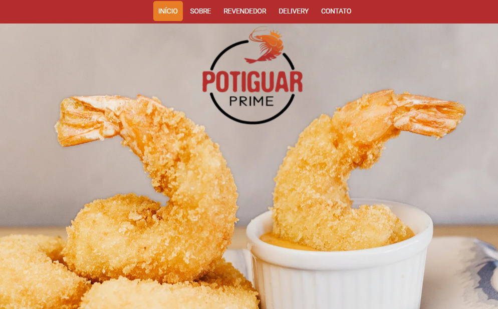

# Landing Page - Potiguar Prime
This is a landing page for a friend's business (Shrimp Farm). I developed this LP as a way to put in practice what I'm learning, with a real situation. I hope that can help someone in anyway. 

# What did I use?
HTML 5; 
CSS 3; 
Javascript; 
Bootstrap 4; 
jQuery; 
PHP (just for sending form through e-mail); 

# What are the features?
Responsible design; 
Flexbox Layout; 
Functional Forms; 
Deeplinking; 
Cool stuff from Bootstrap and jQuery;

# That was my first professional job as a Front End Dev. Hope you enjoy it!

